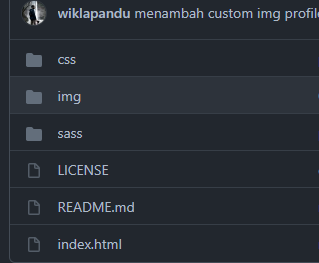

# Link shourtcut template
## Definisi
Ini adalah web untuk membuat link, silahkan mencobanya.

# Documentation

## Change Profile
Untuk merubah profile tambahkan foto anda di folder img.



Configurasi pada file index.html dan cari kode seperti dibawah ini.

```html
<script>
        // * img position
        const position = './img/profile.jpg';

        // ! Don't change this line
        $(document).ready(() => {
            $('#profile img').attr('src', position);
        });
</script>
```
ubah pada bagian ini.
```javascript
const position = './img/profile.jpg'
```
menjadi posisi path file anda, contoh.
```javascript
const position = './img/namaFileAnda.jpg'
```

## Add Links
Buka file index.html kemudian cari code.
```javascript
// list links
        const links = [
            {
                url: 'https://github.com/wiklapandu', // * tujuan url
                icon: 'fab fa-github', // * icon yang dipakai di fontawasome
                text: 'Github', // * yang ditulis untuk link
            },
            {
                url: 'https://www.linkedin.com/in/wiklapandu',
                icon: 'fab fa-linkedin',
                text: 'LinkedIn',
            },
            {
                url: 'https://wiklapandu.medium.com/',
                icon: 'fab fa-medium',
                text: 'Medium',
            },
            {
                url: 'https://www.instagram.com/_wiklapandu/',
                icon: 'fab fa-instagram',
                text: 'Instagram',
            },
        ];
```
hapus code menjadi :
```javascript
const links = [
            {
                url: 'https://github.com/wiklapandu', // * tujuan url
                icon: 'fab fa-github', // * icon yang dipakai di fontawasome
                text: 'Github', // * yang ditulis untuk link
            },
        ];
```
### Keterangan
 - Url isikan dengan url yang ingin dituju (sosial media).
 - Icon isikan dengan class icon pada [fontawesome](https://fontawesome.com/v5.15/icons?d=gallery&p=2&m=free).
 - Text berisi tulisan string yang ingin dilihatkan pada user (facebook,website,ig, dll).
anda hanya boleh merubah dalam array saja sesuaikan format object nya.
```javascript
{
    url: 'https://alamatYangDituju',
    icon: 'class icon pada fontawesome',
    text: 'string yang ingin ditulis',
}
```
## Follow me at
<a href="https://github.com/wiklapandu" target="_blank">
    
</a>
<a href="https://www.instagram.com/_wiklapandu" target="_blank">
    
</a>
<a href="https://www.instagram.com/wwiklapandu" target="_blank">
    
</a>
<br>

## See also
<a href="https://wiklapandu.github.io/" target="_blank">
    
</a>
<a href="https://github.com/wiklapandu/hotelonline2021" target="_blank">
    
</a>
<a href="https://wiklapandu.medium.com/" target="_blank">
    
</a>
<a href="https://wiklapandu.github.io/portofolio/" target="_blank">
    
</a>

## Rules
Copyright Wikla 2021, repo and everything in this repo is made by wikla 2021. [The MIT LICENSE](https://github.com/wiklapandu/link/blob/main/LICENSE)
